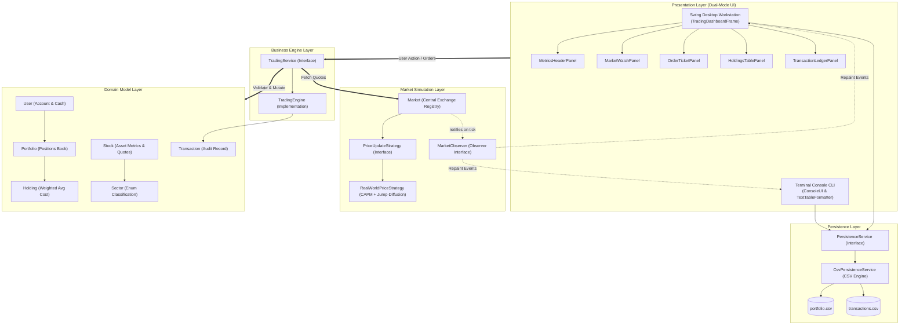

<div align="center">

# 📈 Equity Stock Exchange & Portfolio Management Platform

**An enterprise-grade equities market simulation engine, quantitative stochastic pricing workstation, and real-time portfolio management platform built in Java.**

[](https://www.oracle.com/java/)
[](#-automated-testing--verification)
[](#-system-architecture--design-patterns)
[](#1-modern-desktop-gui-workstation-default)
[](#-prerequisites--dependencies)
[](#-data-persistence-specification)
[](#-architectural-knowledge-graph-graphify)
[](LICENSE)
[](#-contributing-guidelines)

<p align="center">
  <a href="#-project-overview">Overview</a> •
  <a href="#-key-features">Key Features</a> •
  <a href="#-system-architecture--design-patterns">Architecture</a> •
  <a href="#-financial-mathematics--quantitative-modeling">Financial Math</a> •
  <a href="#-listed-equities-universe">Market Assets</a> •
  <a href="#-quick-start--installation">Quick Start</a> •
  <a href="#-automated-testing--verification">Testing</a> •
  <a href="#-author--license">License</a>
</p>

</div>

---

## 📑 Table of Contents

- [Project Overview](#-project-overview)
- [Key Features](#-key-features)
- [System Architecture & Design Patterns](#-system-architecture--design-patterns)
  - [Architectural Topology](#architectural-topology)
  - [Core Design Patterns](#core-design-patterns)
- [Financial Mathematics & Quantitative Modeling](#-financial-mathematics--quantitative-modeling)
  - [1. Multi-Factor Stochastic Price Discovery Engine](#1-multi-factor-stochastic-price-discovery-engine)
  - [2. ARCH/GARCH Simulated Volume Clustering](#2-archgarch-simulated-volume-clustering)
  - [3. Weighted-Average Cost Basis (WACB)](#3-weighted-average-cost-basis-wacb)
  - [4. Realized vs. Unrealized Profit & Loss (P/L)](#4-realized-vs-unrealized-profit--loss-pl)
  - [5. Return on Investment (ROI)](#5-return-on-investment-roi)
- [Listed Equities Universe](#-listed-equities-universe)
- [Workstation & Interface Tour](#-workstation--interface-tour)
  - [1. Modern Desktop GUI Workstation (Default)](#1-modern-desktop-gui-workstation-default)
  - [2. Interactive Headless Terminal Console (CLI Mode)](#2-interactive-headless-terminal-console-cli-mode)
- [Project Directory Structure](#-project-directory-structure)
- [Prerequisites & Dependencies](#-prerequisites--dependencies)
- [Quick Start & Installation](#-quick-start--installation)
  - [Step 1: Clone Repository](#step-1-clone-repository)
  - [Step 2: Build and Launch](#step-2-build-and-launch)
  - [Execution Modes Reference](#execution-modes-reference)
- [Automated Testing & Verification](#-automated-testing--verification)
  - [Test Suite Matrix](#test-suite-matrix)
  - [Sample Verification Output](#sample-verification-output)
- [Data Persistence Specification](#-data-persistence-specification)
  - [Portfolio State (`portfolio.csv`)](#portfolio-state-portfoliocsv)
  - [Transaction Audit Ledger (`transactions.csv`)](#transaction-audit-ledger-transactionscsv)
- [Architectural Knowledge Graph (Graphify)](#-architectural-knowledge-graph-graphify)
- [Contributing Guidelines](#-contributing-guidelines)
- [Author & License](#-author--license)

---

## 🔭 Project Overview

The **Equity Stock Exchange & Portfolio Management Platform** is a full-featured equities exchange simulation and investment portfolio workstation developed in Java. Built with strict adherence to professional software engineering standards, clean Model-View-Controller (MVC) separation, and GoF design patterns, the platform models realistic high-frequency market mechanics without any third-party runtime dependencies.

### Why this project?

Most introductory financial applications rely on simplistic linear random walks. This platform implements institutional-grade quantitative mechanics:
1. **Multi-Factor Stochastic Asset Pricing**: Incorporates Capital Asset Pricing Model (CAPM) beta coefficients ($\beta$), macro-economic systematic index drift, sector covariance shocks, and Merton Jump-Diffusion Poisson-distributed breaking news events.
2. **Dual-Mode User Experience**: Automatically serves a Bloomberg/TradingView-inspired dark-themed desktop workstation (via native Swing/AWT), while seamlessly falling back to an interactive ANSI terminal console in headless or SSH environments.
3. **Institutional Accounting Accuracy**: Real-time position tracking with continuous multi-lot weighted-average cost basis accounting, segregated realized vs. unrealized P/L calculations, and atomic CSV audit trails.
4. **Zero-Dependency Architecture**: Leverages purely Java Standard Library features (`javax.swing`, `java.awt`, `java.nio.file`, `java.util.concurrent`), ensuring instant builds on any machine with JDK 11+.

> [!NOTE]
> The application detects display server availability at startup: running on a desktop automatically boots the graphical workstation, while running inside a container, remote server, or passing `--cli` gracefully starts the interactive terminal UI.

---

## ✨ Key Features

### 📊 Quantitative Market Simulation
- **15 Real-World Large-Cap Equities**: Pre-configured with actual market quotes across 7 foundational sectors (Technology, Semiconductors, Financials, Healthcare, Consumer Staples, Energy, and Automotive).
- **CAPM Systematic Beta Sensitivity ($\beta$)**: High-beta growth assets (e.g., `TSLA` $\beta=2.10$, `NVDA` $\beta=1.95$) experience dynamic magnified responses to macro shifts, whereas defensive consumer staples (e.g., `WMT` $\beta=0.50$, `JNJ` $\beta=0.55$) preserve capital stability.
- **Correlated Sector Covariance**: Industry sectors share correlated performance shocks, causing related equities (e.g., semiconductor chips or banking institutions) to exhibit co-movement.
- **Merton Jump-Diffusion News Shocks**: Simulates black-swan headlines, earnings beats/misses, and sudden regulatory news with a Poisson-distributed trigger (~3.5% probability per tick), producing discontinuous price jumps.
- **ARCH/GARCH Volume Clustering**: Realistic volume surges during high-volatility tick cycles and unexpected news announcements.

### 🖥️ Bloomberg-Style Desktop Workstation
- **Sleek Slate Dark Aesthetic**: Designed with an institutional financial palette (`#0F172A` Slate Base, `#1E293B` Surface, `#38BDF8` Sky Accent, `#10B981` Emerald Gains, `#EF4444` Crimson Losses).
- **Live KPI Performance Cards**: Top-level executive metrics displaying Total Net Worth, Liquid Cash Balance, Equities Valuation, Unrealized P/L, Cumulative Realized P/L, and Macroeconomic Sentiment.
- **Real-Time Interactive Market Watch**: Sortable table with dynamic color-coded price flashes, day changes, percentage moves, beta coefficients, and traded volumes.
- **Streamlined Order Execution Desk**: Quick-fill buttons (`+1`, `+5`, `+10`, `MAX`), instant estimated trade cost calculation, liquid cash validation, and error alert dialogs.
- **Portfolio & Ledger Multi-Tab Panel**: Real-time position breakdown (shares owned, average cost basis, market value, unrealized P/L %, ROI %) and complete chronological transaction history.
- **Simulation Control Center**: Discrete tick triggering alongside background streaming ticker controls (1.5s live market cadence).

### 💼 Portfolio Management & Financial Accounting
- **Continuous Multi-Lot Cost Averaging**: Accurately blends acquisition lots into a weighted-average cost basis upon every buy execution.
- **Realized vs. Unrealized Profit & Loss**: Segregates paper gains/losses from realized gains locked in upon asset liquidation.
- **Cash Liquidity Protection**: Strict guardrails preventing overdrafts, negative position quantities, and short sales.

### 🛡️ Robust Architecture & Reliability
- **Thread-Safe Concurrency**: Backed by `ConcurrentHashMap`, `CopyOnWriteArrayList`, and `synchronized` execution methods to guarantee thread safety during background auto-ticking and concurrent order entries.
- **Domain Exception Hierarchy**: Structured exception handling with typed errors (`InsufficientFundsException`, `InsufficientSharesException`, `InvalidStockSymbolException`, `PersistenceException`).
- **Zero-Dependency Persistence**: Human-readable CSV serialization for user accounts, active holdings, and execution logs.
- **Automated Verification**: Built-in 11-category regression test suite (`TradingPlatformTest`) executing in under 1 second with 100% pass verification.

---

## 🏛️ System Architecture & Design Patterns

The platform is engineered using a clean layered architecture adhering to the **Model-View-Controller (MVC)** design paradigm.

### Architectural Topology



### Core Design Patterns

| Pattern | Component | Responsibility |
|---|---|---|
| **Observer Pattern** | [`MarketObserver`](file:///Users/mridulgupta2911/Downloads/internship/StockExchange/src/main/java/com/exchange/market/MarketObserver.java) & [`Market`](file:///Users/mridulgupta2911/Downloads/internship/StockExchange/src/main/java/com/exchange/market/Market.java) | The Market decouples state updates from display layers. Whenever a simulation tick occurs, all registered UI panels update their quotes, metrics, and valuations in real time. |
| **Strategy Pattern** | [`PriceUpdateStrategy`](file:///Users/mridulgupta2911/Downloads/internship/StockExchange/src/main/java/com/exchange/market/PriceUpdateStrategy.java) & [`RealWorldPriceStrategy`](file:///Users/mridulgupta2911/Downloads/internship/StockExchange/src/main/java/com/exchange/market/RealWorldPriceStrategy.java) | Encapsulates price fluctuation algorithms behind an interface, enabling seamless hot-swapping between historical replays, Brownian walk, and multi-factor jump-diffusion strategies. |
| **Service / Facade Pattern** | [`TradingService`](file:///Users/mridulgupta2911/Downloads/internship/StockExchange/src/main/java/com/exchange/engine/TradingService.java) & [`TradingEngine`](file:///Users/mridulgupta2911/Downloads/internship/StockExchange/src/main/java/com/exchange/engine/TradingEngine.java) | Provides a unified API entry point (`executeBuy`, `executeSell`) hiding internal validation, account debiting/crediting, and ledger journaling. |
| **Model-View-Controller (MVC)** | Presentation vs Domain vs Engine | Strictly isolates domain business rules (`Holding`, `Portfolio`, `User`) from GUI rendering (`javax.swing`) and terminal formatting. |

---

## 🧮 Financial Mathematics & Quantitative Modeling

### 1. Multi-Factor Stochastic Price Discovery Engine

For each simulation tick $t$, the net rate of return $r_{i, t}$ for asset $i$ is formulated as a composite stochastic differential equation:

$$r_{i, t} = \underbrace{\beta_i \cdot r_{\text{macro}, t}}_{\text{Systematic Drift}} + \underbrace{\frac{1}{2}\beta_i \cdot r_{\text{sector}, t}}_{\text{Sector Covariance}} + \underbrace{\sigma_i \cdot Z_{i, t}}_{\text{Idiosyncratic Diffusion}} + \underbrace{J_{i, t} \cdot N_{i, t}}_{\text{Merton Jump Shock}} + \underbrace{\kappa \left(\frac{S_{i, 0} - S_{i, t}}{S_{i, 0}}\right)}_{\text{Intraday Mean Reversion}}$$

Where:
- **$r_{\text{macro}, t} \sim \mathcal{N}(\mu_{\text{macro}}, \sigma_{\text{macro}}^2)$**: Macro systematic market drift ($\mu = +0.02\%$, $\sigma = 0.6\%$).
- **$\beta_i$**: Asset sensitivity to broader market movements (Capital Asset Pricing Model).
- **$r_{\text{sector}, t} \sim \mathcal{N}(0, \sigma_{\text{sector}}^2)$**: Industry sector shock ($\sigma_{\text{sector}} = 0.8\%$) shared across all stocks within the same sector.
- **$\sigma_i$**: Asset baseline volatility parameter; $Z_{i, t} \sim \mathcal{N}(0, 1)$ represents standard Brownian motion.
- **$N_{i, t} \sim \text{Poisson}(\lambda)$**: Poisson jump indicator where $\lambda = 0.035$ (~3.5% occurrence probability per tick).
- **$J_{i, t} \sim \mathcal{N}(0, (3.5 \cdot \sigma_i)^2)$**: Jump magnitude scaling to $3.5\times$ asset volatility, modeling earnings surprises and major macro events.
- **$\kappa$**: Mean reversion velocity factor ($\kappa = 0.04$), stabilizing intraday swings toward the opening reference price $S_{i, 0}$.

The updated asset spot price is clamped to avoid unrealistic single-tick extremes and enforces a hard penny floor:

$$S_{i, t+1} = \max\left(\$0.50, \; S_{i, t} \times \left(1 + \text{clamp}(r_{i, t}, -5.5\%, +5.5\%)\right)\right)$$

### 2. ARCH/GARCH Simulated Volume Clustering

Trading volume dynamically expands during volatile price swings and jumps, reflecting authentic liquidity clustering:

$$V_{i, t} = \left( \frac{100,000}{S_{i, t}} \right) \times \left(1 + 45 \cdot |r_{i, t}|\right) \times \Lambda_{\text{jump}} + \varepsilon_{\text{noise}}$$

Where $\Lambda_{\text{jump}} \in [2.5, 5.5]$ if a news shock occurs, and $1.0$ otherwise.

### 3. Weighted-Average Cost Basis (WACB)

When acquiring additional shares of an already held equity, the platform computes the blended weighted-average cost basis:

$$\bar{C}_{\text{new}} = \frac{(Q_{\text{current}} \times \bar{C}_{\text{current}}) + (Q_{\text{acquired}} \times P_{\text{execution}})}{Q_{\text{current}} + Q_{\text{acquired}}}$$

### 4. Realized vs. Unrealized Profit & Loss (P/L)

- **Unrealized (Mark-to-Market) P/L**:
  $$\text{Unrealized P/L} = (P_{\text{spot}} - \bar{C}) \times Q_{\text{held}}$$
  $$\text{Unrealized P/L } \% = \left(\frac{P_{\text{spot}} - \bar{C}}{\bar{C}}\right) \times 100\%$$

- **Realized P/L (Captured upon partial or total liquidation)**:
  $$\text{Realized P/L} = (P_{\text{execution}} - \bar{C}) \times Q_{\text{sold}}$$

### 5. Return on Investment (ROI)

Tracks aggregate performance against initial capital:

$$\text{ROI} = \left( \frac{\text{Net Worth} - \text{Initial Deposit}}{\text{Initial Deposit}} \right) \times 100\%$$

Where $\text{Net Worth} = \text{Liquid Cash Balance} + \sum_{i} (Q_i \times P_{\text{spot}, i})$.

---

## 📊 Listed Equities Universe

The exchange comes seeded with 15 large-cap equities representing diverse market sectors, volatility ratings, and beta sensitivities:

| Ticker | Company Name | Sector | Spot Price | Beta ($\beta$) | Volatility ($\sigma$) | Market Profile |
|:---:|:---|:---|:---:|:---:|:---:|:---|
| `AAPL` | Apple Inc. | Technology | $224.50 | 1.15 | 1.6% | Mega-cap Consumer Tech & Ecosystem |
| `MSFT` | Microsoft Corp. | Technology | $432.10 | 1.10 | 1.4% | Enterprise Software & Cloud Infrastructure |
| `GOOGL`| Alphabet Inc. | Technology | $178.40 | 1.12 | 1.7% | Digital Advertising & AI Platforms |
| `META` | Meta Platforms Inc. | Technology | $515.20 | 1.35 | 2.2% | Social Media & VR Growth |
| `NVDA` | NVIDIA Corporation | Semiconductors | $119.80 | 1.95 | 3.2% | AI Acceleration & High-Beta Semiconductor |
| `TSLA` | Tesla Inc. | Automotive | $210.60 | 2.10 | 3.8% | Autonomous Driving & High-Beta EV Growth |
| `JPM`  | JPMorgan Chase & Co. | Financials | $212.30 | 0.95 | 1.2% | Universal Banking & Treasury Market Leader |
| `GS`   | Goldman Sachs Group | Financials | $485.60 | 1.15 | 1.5% | Investment Banking & Capital Markets |
| `V`    | Visa Inc. | Financials | $268.90 | 0.90 | 1.1% | Global Transaction Processing & Payments |
| `LLY`  | Eli Lilly and Co. | Healthcare | $945.80 | 0.65 | 1.5% | Biopharmaceuticals & GLP-1 Market Leader |
| `JNJ`  | Johnson & Johnson | Healthcare | $162.30 | 0.55 | 0.8% | Defensive Healthcare & Medical Devices |
| `AMZN` | Amazon.com Inc. | Consumer Staples | $186.25 | 1.25 | 1.9% | E-Commerce Retail & AWS Cloud Services |
| `WMT`  | Walmart Inc. | Consumer Staples | $68.50 | 0.50 | 0.9% | Low-Beta Defensive Grocery & Omnichannel |
| `COST` | Costco Wholesale | Consumer Staples | $885.20 | 0.75 | 1.1% | Membership Retail & Consistent Cash Flows |
| `XOM`  | Exxon Mobil Corp. | Energy | $114.50 | 0.85 | 1.6% | Integrated Oil, Gas & Commodity Cyclical |

---

## 🖥️ Workstation & Interface Tour

### 1. Modern Desktop GUI Workstation (Default)

The Swing graphical trading workstation is styled with modern dark financial aesthetics:

```text
+-----------------------------------------------------------------------------------------------+
|  METRICS HEADER PANEL                                                                         |
|  [ Net Worth: $104,250.00 ] [ Cash: $84,120.00 ] [ Equities: $20,130.00 ]                     |
|  [ Unrealized P/L: +$3,420.00 (+20.5%) ] [ Realized P/L: +$830.00 ] [ Macro: Bullish (+0.42%) ]|
+-----------------------------------------------------------------------------------------------+
|  TOOLBAR: [ Next Simulation Tick ]  [ Start Auto-Tick Stream ]  [ Save State ]  [ Reset Demo ]|
+-------------------------------------------------------+---------------------------------------+
|  LIVE MARKET WATCH DESK                               |  ORDER EXECUTION DESK                 |
|  Symbol | Company     | Price   | Change  | % Change  |  Action:   (o) BUY   ( ) SELL         |
|  AAPL   | Apple Inc.  | $226.10 | +$1.60  | +0.71%    |  Symbol:   [ AAPL       v ]           |
|  NVDA   | NVIDIA      | $123.40 | +$3.60  | +3.01%    |  Shares:   [ - ] [ 10 ] [ + ]         |
|  TSLA   | Tesla Inc.  | $214.20 | +$3.60  | +1.71%    |  Quick:    [ +1 ] [ +5 ] [ +10 ] [MAX]|
|  MSFT   | Microsoft   | $431.50 | -$0.60  | -0.14%    |  Est. Cost: $2,261.00                 |
|  ...    | ...         | ...     | ...     | ...       |  [ SUBMIT MARKET ORDER ]              |
+-------------------------------------------------------+---------------------------------------+
|  PORTFOLIO & AUDIT LEDGER TABS                                                                |
|  [ Holdings Portfolio ]  [ Chronological Transaction Ledger ]                                 |
|  Symbol | Shares | Avg Cost | Spot Price | Market Value | Unrealized P/L ($) | Unrealized ROI%|
|  AAPL   | 20     | $220.00  | $226.10    | $4,522.00    | +$122.00           | +2.77%         |
|  NVDA   | 50     | $115.00  | $123.40    | $6,170.00    | +$420.00           | +7.30%         |
+-----------------------------------------------------------------------------------------------+
```

#### Workstation Panels Breakdown:
1. **Metrics Header Panel**: Instant overview of portfolio health, total liquid buying power, asset values, and macroeconomic sentiment.
2. **Simulation Controls**: Trigger manual step ticks or initiate real-time auto-streaming (1.5-second clock ticks).
3. **Live Market Watch**: Interactive table with color-coded quotes (green for uptick, red for downtick), day change, volume, and beta values. Clicking an equity automatically pre-populates the Order Execution Desk.
4. **Order Execution Desk**: Instant validation with cash check, share inventory check, quick-fill multipliers, and real-time total order cost calculation.
5. **Holdings & Ledger Tabs**:
   - *Holdings Table*: Live positions with blended weighted-average cost basis, spot valuation, and percentage return.
   - *Transaction Ledger*: Chronological audit trail of all executed BUY/SELL trades with timestamps, quantities, execution prices, and realized capital gains.

---

### 2. Interactive Headless Terminal Console (CLI Mode)

For terminal users, SSH sessions, or continuous integration environments, the CLI mode provides an interactive menu:

```text
==========================================================
      EQUITY STOCK EXCHANGE & PORTFOLIO WORKSTATION       
==========================================================
 Investor: Mridul Gupta | Liquid Cash: $99,837.70
 Net Worth: $100,000.00 | Total Equities: $162.30
 Market Sentiment: Bullish (+0.38%) | Sim Ticks: 4
==========================================================
 1. View Market Data (15 Equities)
 2. Execute Market Buy Order
 3. Execute Market Sell Order
 4. View Investment Portfolio Positions
 5. View Chronological Transaction Ledger
 6. Advance Market Simulation Cycle (Tick)
 7. View Detailed Account Summary & Metrics
 8. Save Current Session State to Disk
 9. Save and Exit
==========================================================
Select an option (1-9): 
```

---

## 📁 Project Directory Structure

```text
StockExchange/
├── .agents/                        # Agentic workflow definitions & graphify rules
├── bin/                            # Compiled Java bytecode classfiles (.class)
├── data/                           # Zero-dependency CSV persistence files
│   ├── portfolio.csv               # User profile state & active portfolio positions
│   └── transactions.csv            # Append-only historical trade execution ledger
├── docs/                           # Generated Javadoc HTML documentation
├── graphify-out/                   # Graphify architectural knowledge graph
│   ├── graph.html                  # Interactive 3D/2D visual knowledge graph UI
│   ├── graph.json                  # Graph topology data (454 nodes, 1016 edges)
│   └── GRAPH_REPORT.md             # Graphify structural report & god node analysis
├── src/
│   ├── main/java/com/exchange/
│   │   ├── Main.java               # Application bootstrap driver (dual-mode launcher)
│   │   ├── engine/                 # Order execution & matching engine
│   │   │   ├── TradingEngine.java  # Core trading engine implementation
│   │   │   └── TradingService.java # Trading business logic service interface
│   │   ├── exception/              # Custom domain exceptions
│   │   │   ├── InsufficientFundsException.java
│   │   │   ├── InsufficientSharesException.java
│   │   │   ├── InvalidStockSymbolException.java
│   │   │   ├── PersistenceException.java
│   │   │   └── TradingException.java
│   │   ├── market/                 # Market exchange simulation & quantitative pricing
│   │   │   ├── Market.java         # Central exchange registry & tick broadcaster
│   │   │   ├── MarketObserver.java # Observer interface for market tick broadcasts
│   │   │   ├── PriceUpdateStrategy.java # Strategy interface for asset pricing
│   │   │   ├── RealWorldPriceStrategy.java # CAPM + Sector + Jump-Diffusion engine
│   │   │   └── VolatilityPriceStrategy.java # Baseline Gaussian random walk model
│   │   ├── model/                  # Domain data models & entities
│   │   │   ├── Holding.java        # Position tracking with weighted cost basis
│   │   │   ├── Portfolio.java      # User portfolio collection manager
│   │   │   ├── Sector.java         # Market industry sector enumeration
│   │   │   ├── Stock.java          # Equity asset model with quotes & beta
│   │   │   ├── Transaction.java    # Completed trade execution record
│   │   │   ├── TransactionType.java# BUY / SELL operation types
│   │   │   └── User.java           # Trader account profile with cash balance
│   │   ├── persistence/            # File storage & serialization layer
│   │   │   ├── CsvPersistenceService.java # Atomic CSV file storage provider
│   │   │   └── PersistenceService.java # Storage abstraction interface
│   │   └── ui/                     # Presentation views (GUI & CLI)
│   │       ├── ConsoleUI.java      # Interactive terminal console interface
│   │       ├── TextTableFormatter.java # ANSI table layout renderer
│   │       └── gui/                # Swing desktop GUI workstation
│   │           ├── GuiTheme.java   # Financial dark workstation design system
│   │           ├── HoldingsTablePanel.java # Portfolio positions view
│   │           ├── MarketWatchPanel.java # Real-time quotes table
│   │           ├── MetricsHeaderPanel.java # Executive KPI metric cards
│   │           ├── OrderTicketPanel.java # Buy/Sell order desk
│   │           ├── TradingDashboardFrame.java # Main top-level desktop window
│   │           └── TransactionLedgerPanel.java # Historical audit log table
│   └── test/java/com/exchange/
│       └── TradingPlatformTest.java # Automated verification test suite (11 areas)
├── LICENSE                         # MIT License
├── README.md                       # Comprehensive project documentation
└── run.sh                          # Universal build, execution, test & docs script
```

---

## ☕ Prerequisites & Dependencies

- **Java Development Kit (JDK)**: Java 11 or newer (Java 17, 21, and 23 fully supported).
  ```bash
  java -version
  javac -version
  ```
- **Operating System**: macOS, Linux, or Windows (via WSL or Git Bash).
- **External Dependencies**: **None!** The platform uses 100% pure Java Standard Library (`javax.swing`, `java.awt`, `java.nio.file`, `java.util.concurrent`). No external JARs, Maven, or Gradle downloads required.

---

## 🚀 Quick Start & Installation

### Step 1: Clone Repository

```bash
git clone https://github.com/J0KEEER/StockExchange.git
cd StockExchange
chmod +x run.sh
```

### Step 2: Build and Launch

#### Launch Modern Desktop GUI Workstation (Default)
```bash
./run.sh
# or
./run.sh gui
```

#### Launch Interactive Headless Terminal Console (CLI Mode)
```bash
./run.sh cli
```

#### Run Automated Regression Verification Tests
```bash
./run.sh test
```

#### Generate Clean Javadoc Documentation
```bash
./run.sh docs
```
*Generated documentation is output to `docs/index.html`.*

#### Update Graphify Architectural Knowledge Graph
```bash
./run.sh graph
```

---

### Execution Modes Reference

| Command | Target Mode | Description |
|---|---|---|
| `./run.sh` or `./run.sh gui` | Desktop GUI | Compiles and launches the Swing dark-themed desktop workstation. |
| `./run.sh cli` | Terminal CLI | Compiles and starts the interactive text-mode terminal console. |
| `./run.sh test` | Automated Tests | Runs the 11-category regression test suite with 100% assertions. |
| `./run.sh docs` | Javadocs | Compiles complete HTML documentation for all packages into `docs/`. |
| `./run.sh graph` | Knowledge Graph | Re-indexes AST knowledge graph and updates `graphify-out/graph.html`. |

#### Direct Compilation & Execution (Without `run.sh`):
```bash
# 1. Compile all source and test classes
mkdir -p bin
javac -d bin $(find src/main/java src/test/java -name "*.java")

# 2. Run Desktop GUI Workstation
java -cp bin com.exchange.Main

# 3. Run Headless CLI Mode
java -cp bin com.exchange.Main --cli

# 4. Run Automated Test Suite
java -cp bin com.exchange.TradingPlatformTest
```

---

## 🧪 Automated Testing & Verification

The platform features a standalone automated regression verification suite ([`TradingPlatformTest.java`](file:///Users/mridulgupta2911/Downloads/internship/StockExchange/src/test/java/com/exchange/TradingPlatformTest.java)) requiring zero third-party testing frameworks.

### Test Suite Matrix

| # | Test Case Identifier | Verification Scope |
|:---:|:---|:---|
| 1 | `Stock Creation and Metric Boundary Test` | Asserts spot quote initialization, sector tagging, beta values, and volume invariants. |
| 2 | `Holding Weighted-Average Cost Basis Test` | Validates mathematical precision of blended multi-lot purchase cost bases. |
| 3 | `Holding Liquidation Realized P/L Test` | Verifies exact realized capital gains calculation upon full and partial liquidations. |
| 4 | `Buy Order Execution & Balance Debit Test` | Confirms cash debiting, share credit, and transaction ledger generation. |
| 5 | `Insufficient Funds Buy Rejection Test` | Verifies that purchases exceeding cash balance throw `InsufficientFundsException`. |
| 6 | `Sell Order Execution & Balance Credit Test` | Asserts cash credit, share deduction, and realized P/L ledger recording. |
| 7 | `Insufficient Shares Sell Rejection Test` | Verifies that selling more shares than owned throws `InsufficientSharesException`. |
| 8 | `Invalid Stock Symbol Rejection Test` | Asserts rejection of unlisted or malformed ticker symbols via `InvalidStockSymbolException`. |
| 9 | `Market Observer Notification Pattern Test` | Verifies loose coupling and broadcast delivery to registered observers on simulation ticks. |
| 10 | `CSV Persistence Save and Reload Round-Trip` | Ensures round-trip serialization/deserialization integrity of user cash, holdings, and transactions. |
| 11 | `Real-World Quantitative Price Strategy Test` | Verifies CAPM beta differentiation, variance boundaries, and absence of runaway pricing. |

### Sample Verification Output

```text
$ ./run.sh test
==========================================================
  Equity Stock Exchange & Portfolio Management Platform
==========================================================
Compiling Java source and test files...
Running automated verification tests...
=================================================================
  RUNNING TRADING PLATFORM AUTOMATED VERIFICATION SUITE
=================================================================
  [PASS] Stock Creation and Metric Boundary Test
  [PASS] Holding Weighted-Average Cost Basis Test
  [PASS] Holding Liquidation Realized P/L Calculation Test
  [PASS] Buy Order Execution & Balance Debit Test
  [PASS] Insufficient Funds Buy Rejection Test
  [PASS] Sell Order Execution & Balance Credit Test
  [PASS] Insufficient Shares Sell Rejection Test
  [PASS] Invalid Stock Symbol Rejection Test
  [PASS] Market Observer Notification Pattern Test
  [PASS] CSV Persistence Save and Reload Round-Trip Test
  [PASS] Real-World Quantitative Price Strategy & Beta Test
=================================================================
  TEST RESULTS: 11/11 PASSED (100.0%)
=================================================================
```

---

## 💾 Data Persistence Specification

Session data is stored in human-readable, zero-dependency CSV format within the [`data/`](file:///Users/mridulgupta2911/Downloads/internship/StockExchange/data) directory.

### Portfolio State (`portfolio.csv`)
Maintains account credentials, cash balance, initial deposit baseline, and active equity holdings:

```csv
RECORD_TYPE,FIELD_1,FIELD_2,FIELD_3,FIELD_4,FIELD_5
USER,63AA8B68,Mridul,99837.70,100000.00,0.00
HOLDING,JNJ,1,162.3000,162.30,
```

- **`USER` Record**: `RECORD_TYPE`, `AccountId`, `Username`, `CashBalance`, `InitialDeposit`, `RealizedPnl`
- **`HOLDING` Record**: `RECORD_TYPE`, `TickerSymbol`, `Quantity`, `AverageCostBasis`, `TotalInvested`

### Transaction Audit Ledger (`transactions.csv`)
Append-only chronological trade execution ledger:

```csv
transactionId,timestamp,type,symbol,quantity,executionPrice,totalAmount,realizedGainLoss
411F12DF,2026-09-13T18:13:32.68869,BUY,AAPL,5,224.50,1122.50,0.00
D0BB4269,2026-09-13T18:13:50.985518,SELL,AAPL,5,224.50,1122.50,0.00
96729B3B,2026-09-13T18:41:00.841336,BUY,JNJ,1,162.30,162.30,0.00
```

---

## 🧠 Architectural Knowledge Graph (Graphify)

The project incorporates an AST-extracted architectural knowledge graph mapped using **Graphify** in [`graphify-out/`](file:///Users/mridulgupta2911/Downloads/internship/StockExchange/graphify-out):

- **Interactive Visualization**: Open `graphify-out/graph.html` in any modern web browser to interactively explore the 3D/2D node-link topology.
- **Topological Metrics**:
  - **454 Total Nodes** (Classes, Methods, Fields, Interfaces)
  - **1,016 Directed Edges** (Calls, Extends, Implements, References)
  - **26 Detected Communities** (Clustered modules: Engine, Market, Models, UI Panels)
- **Architecture Report**: Detailed in [`graphify-out/GRAPH_REPORT.md`](file:///Users/mridulgupta2911/Downloads/internship/StockExchange/graphify-out/GRAPH_REPORT.md) highlighting God Nodes and bridge components.
- **CLI Query Example**:
  ```bash
  graphify query "How does RealWorldPriceStrategy compute multi-factor movements for Stock?"
  ```

---

## 🤝 Contributing Guidelines

Contributions from developers and financial engineers are welcome! To contribute:

1. **Fork the Repository**:
   ```bash
   git checkout -b feature/your-feature-name
   ```
2. **Follow Code Standards**:
   - Write clean, type-safe Java code adhering to standard conventions.
   - Include Javadoc comments for all public classes, methods, and fields.
   - Maintain zero external runtime dependencies.
3. **Add Tests**:
   - Add new verification methods to [`TradingPlatformTest.java`](file:///Users/mridulgupta2911/Downloads/internship/StockExchange/src/test/java/com/exchange/TradingPlatformTest.java).
   - Ensure all 11+ tests pass with `100%` verification before committing.
4. **Commit & Push**:
   ```bash
   git commit -m "feat(market): add limit order matching engine"
   git push origin feature/your-feature-name
   ```
5. **Open a Pull Request**: Provide a clear description of the enhancements and automated verification results.

---

## 👤 Author & License

### Author
- **Mridul Gupta**  
  GitHub: [@J0KEEER](https://github.com/J0KEEER)  
  Department of Computer Science & Engineering  

### License
This project is licensed under the **MIT License** — see the [LICENSE](LICENSE) file for details.

---

<div align="center">
  <sub>Built with precision and passion for financial engineering and software craftsmanship.</sub>
</div>
